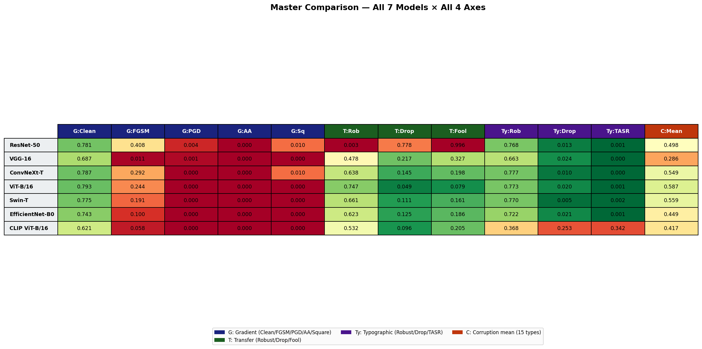
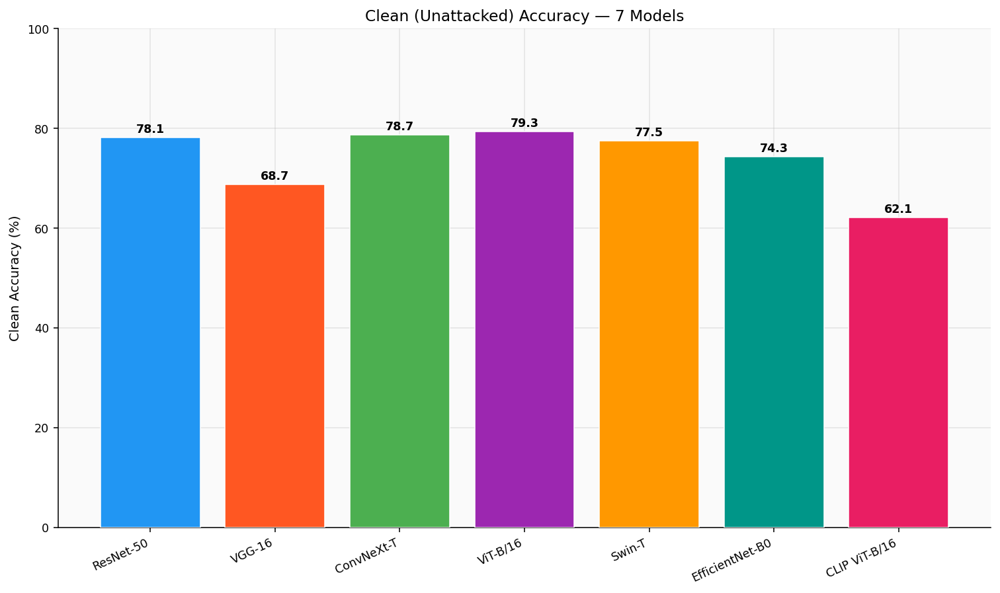
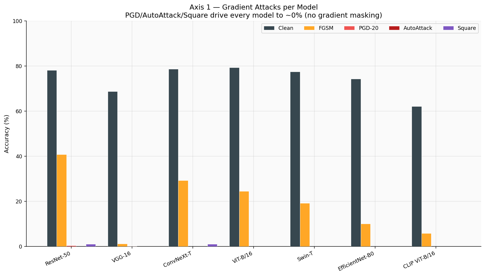
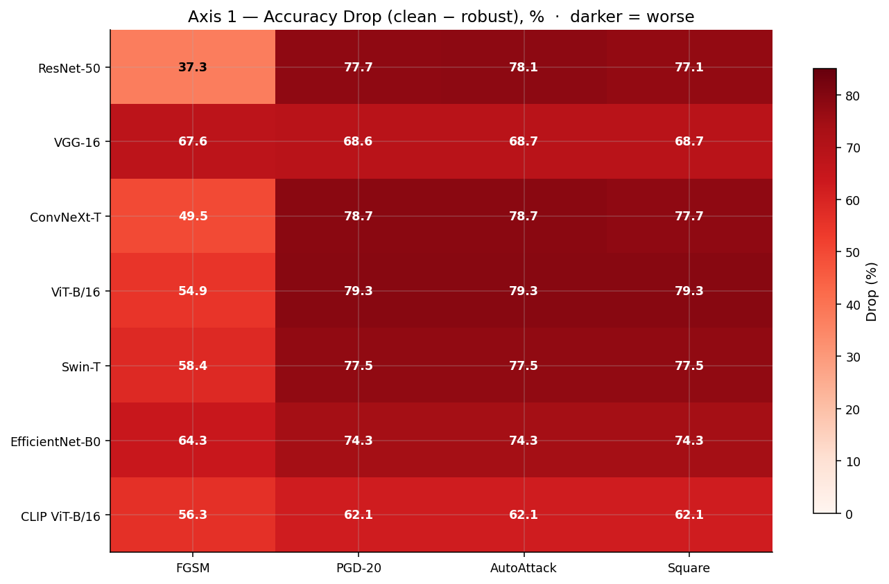
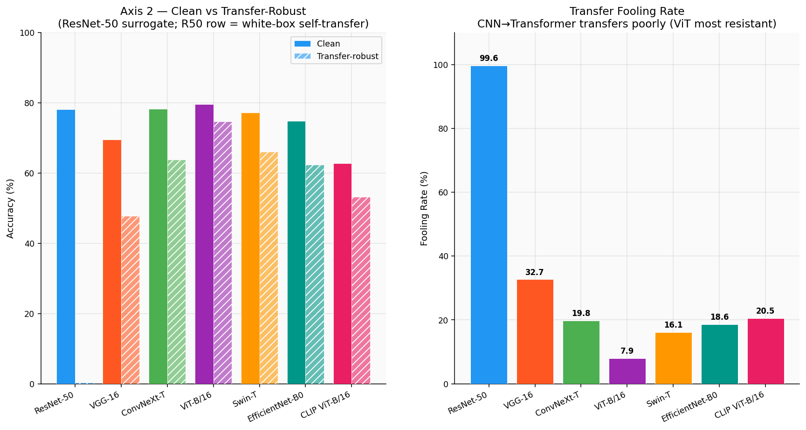
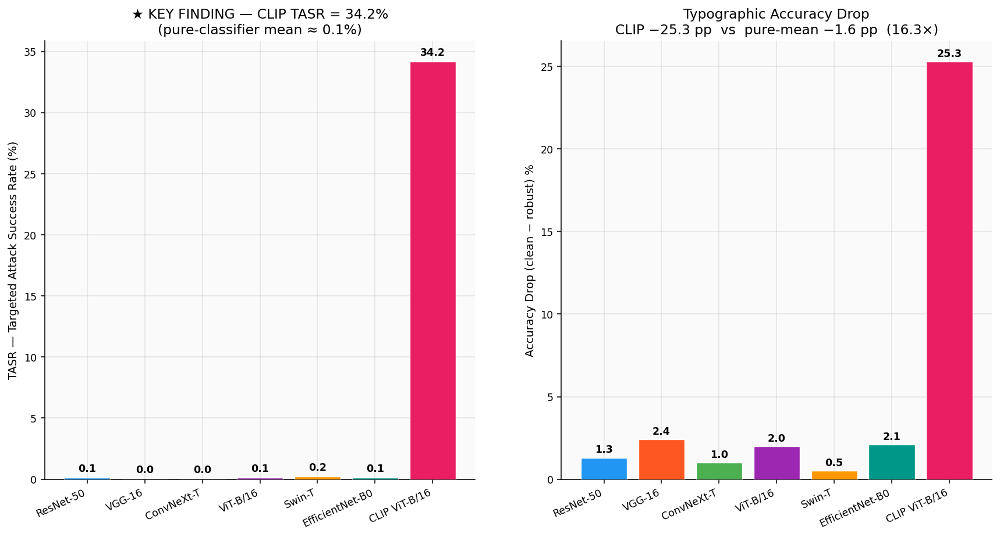
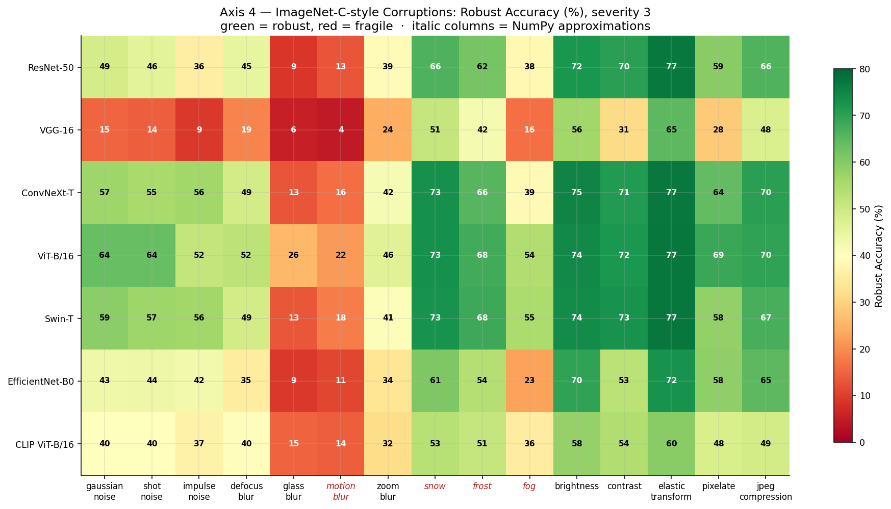
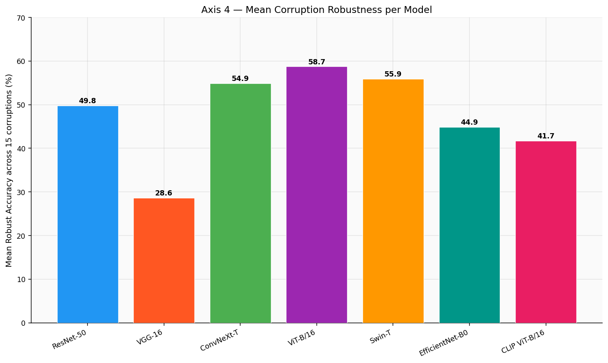
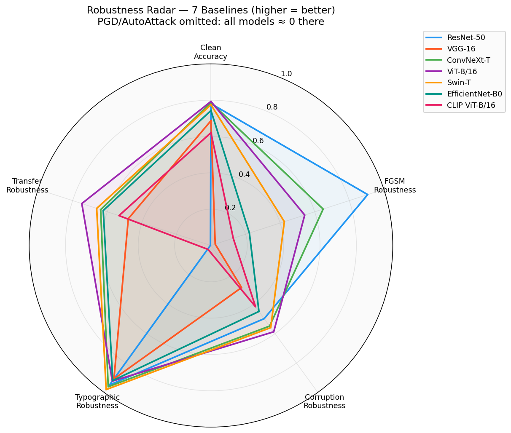

# Adversarial-Robustness Benchmark — Full Results

_7 vision models × 4 attack axes. Every number in this report is read directly from the per-cell JSONs in `results/` and cross-checked against the committed CSVs by [`generate_benchmark_report.py`](../../generate_benchmark_report.py); nothing is hand-typed._

- **Models (7 baselines):** ResNet-50, VGG-16, ConvNeXt-T, ViT-B/16, Swin-T, EfficientNet-B0, CLIP ViT-B/16
- **Threat model:** L∞, ε = 8/255 ≈ 0.0314 in [0,1] pixel space, seed 42
- **Dataset:** ImageNet-1k, 1000-image class-balanced subset (200 for AutoAttack/Square)
- **Hardware:** single Tesla T4 (Kaggle free tier)

---

## Bottom line — successes and failures

**What worked (successes):**

- **The harness is validated and trustworthy.** ResNet-50 self-transfer (0.003) matches white-box PGD (0.004) within ±0.001; AutoAttack ≤ PGD for all 7 baselines; no gradient masking detected (PGD−Square gap < 0.10 everywhere).
- **One genuine finding — the CLIP typographic inversion.** CLIP ViT-B/16 reaches TASR = **34.2%** vs a pure-classifier mean of ≈ 0.1%, and its clean→robust drop (25.3%) is **16.3×** the pure-classifier mean (1.6%). Language grounding is a *liability* here, not a defense.
- **Three confirmatory axes** (gradient collapse, CNN→Transformer transfer gap, corruption fragility) are correct and well-measured.

**What failed (failures, reported honestly):**

- **The corruptions axis fails its own pre-registered validity window.** Baseline mean drop = **0.263**, outside the literature window [0.05, 0.25] → the runner prints **FAIL**. 4/15 corruptions are NumPy approximations, so absolute numbers are *ImageNet-C-style*, not canonical ImageNet-C.
- **Single seed, no confidence intervals**, and AutoAttack/Square run on only 200 images. Floor effects (→0%) are safe; small margins carry no statistical weight.

## Data integrity

All metrics recomputed from raw counts (`correct / dataset_size`) match the stored accuracy fields, and all JSON values match the committed CSVs. **0 discrepancies found.** ✅

---

## Master comparison — all 7 models × all 4 axes

Legend: **G** = gradient, **T** = transfer, **Ty** = typographic, **C** = corruption mean. Rob = robust accuracy, Drop = clean−robust, Fool = fooling rate, TASR = targeted attack success rate.

| Model | G:Clean | G:FGSM | G:PGD | G:AA | G:Sq | T:Rob | T:Drop | T:Fool | Ty:Rob | Ty:Drop | Ty:TASR | C:Mean |
| --- | --- | --- | --- | --- | --- | --- | --- | --- | --- | --- | --- | --- |
| ResNet-50 | 0.781 | 0.408 | 0.004 | 0.000 | 0.010 | 0.003 | 0.778 | 0.996 | 0.768 | 0.013 | 0.001 | 0.498 |
| VGG-16 | 0.687 | 0.011 | 0.001 | 0.000 | 0.000 | 0.478 | 0.217 | 0.327 | 0.663 | 0.024 | 0.000 | 0.286 |
| ConvNeXt-T | 0.787 | 0.292 | 0.000 | 0.000 | 0.010 | 0.638 | 0.145 | 0.198 | 0.777 | 0.010 | 0.000 | 0.549 |
| ViT-B/16 | 0.793 | 0.244 | 0.000 | 0.000 | 0.000 | 0.747 | 0.049 | 0.079 | 0.773 | 0.020 | 0.001 | 0.587 |
| Swin-T | 0.775 | 0.191 | 0.000 | 0.000 | 0.000 | 0.661 | 0.111 | 0.161 | 0.770 | 0.005 | 0.002 | 0.559 |
| EfficientNet-B0 | 0.743 | 0.100 | 0.000 | 0.000 | 0.000 | 0.623 | 0.125 | 0.186 | 0.722 | 0.021 | 0.001 | 0.449 |
| CLIP ViT-B/16 | 0.621 | 0.058 | 0.000 | 0.000 | 0.000 | 0.532 | 0.096 | 0.205 | 0.368 | 0.253 | 0.342 | 0.417 |

---

## Axis 1 — Gradient attacks (white-box)

FGSM · PGD-20 · AutoAttack (standard ensemble) · Square (5000 queries, black-box).

| Model | Clean | FGSM | PGD-20 | AutoAttack | Square |
| --- | --- | --- | --- | --- | --- |
| ResNet-50 | 0.781 | 0.408 | 0.004 | 0.000 | 0.010 |
| VGG-16 | 0.687 | 0.011 | 0.001 | 0.000 | 0.000 |
| ConvNeXt-T | 0.787 | 0.292 | 0.000 | 0.000 | 0.010 |
| ViT-B/16 | 0.793 | 0.244 | 0.000 | 0.000 | 0.000 |
| Swin-T | 0.775 | 0.191 | 0.000 | 0.000 | 0.000 |
| EfficientNet-B0 | 0.743 | 0.100 | 0.000 | 0.000 | 0.000 |
| CLIP ViT-B/16 | 0.621 | 0.058 | 0.000 | 0.000 | 0.000 |

**Read:** All 7 baselines collapse to ≈0% under PGD-20 and AutoAttack — the expected, well-known result for undefended ImageNet models. FGSM (a single step) leaves the most on the table: ResNet-50 is the most FGSM-resilient (40.8%), VGG-16 the least (1.1%).

**Sanity checks (from `gradient/sanity_checks.json`):**

- PGD reduces VGG-16: clean 0.687 → robust 0.001 (drop 0.686) — **PASS**
- AutoAttack ≤ PGD for every model — **PASS**
- Gradient masking: none detected (PGD−Square gap < 0.10 for all 7 models) — **PASS**

---

## Axis 2 — Transfer attacks (black-box)

PGD-20 adversarials crafted once on the ResNet-50 surrogate, evaluated on all targets. The ResNet-50 row is the white-box self-transfer reference.

| Model | White-box? | Clean | Transfer-Robust | Drop | Fooling Rate |
| --- | --- | --- | --- | --- | --- |
| ResNet-50 | yes | 0.781 | 0.003 | 0.778 | 0.996 |
| VGG-16 | no | 0.695 | 0.478 | 0.217 | 0.327 |
| ConvNeXt-T | no | 0.783 | 0.638 | 0.145 | 0.198 |
| ViT-B/16 | no | 0.796 | 0.747 | 0.049 | 0.079 |
| Swin-T | no | 0.772 | 0.661 | 0.111 | 0.161 |
| EfficientNet-B0 | no | 0.748 | 0.623 | 0.125 | 0.186 |
| CLIP ViT-B/16 | no | 0.628 | 0.532 | 0.096 | 0.205 |

**Read:** CNN→CNN transfers more readily than CNN→Transformer. Most susceptible target: VGG-16 (drop 21.7%); most resistant: ViT-B/16 (drop 4.9%).

**Sanity (Gate B, from `transfer/sanity_checks.json`):** self-transfer 0.003 ≈ gradient PGD 0.004 (diff 0.001) — **PASS**; 4/6 non-surrogate models show >10% drop — **PASS**.

_Note: transfer-axis clean accuracies differ slightly from the gradient axis (e.g. CLIP 0.628 vs 0.621) because every model is evaluated on the same ResNet-50 resize/crop pixel tensor here; this is disclosed and expected, not an inconsistency._

---

## Axis 3 — Typographic attack ★ (the one real finding)

A white sticker printed with a *wrong* class name (lowercase first synonym) is overlaid on each image. **TASR** (targeted attack success rate) = fraction of images the model then predicts as the exact class named on the sticker.

| Model | Clean | Robust | Drop | Fooling Rate | TASR |
| --- | --- | --- | --- | --- | --- |
| ResNet-50 | 0.781 | 0.768 | 0.013 | 0.036 | 0.001 |
| VGG-16 | 0.687 | 0.663 | 0.024 | 0.076 | 0.000 |
| ConvNeXt-T | 0.787 | 0.777 | 0.010 | 0.032 | 0.000 |
| ViT-B/16 | 0.793 | 0.773 | 0.020 | 0.039 | 0.001 |
| Swin-T | 0.775 | 0.770 | 0.005 | 0.032 | 0.002 |
| EfficientNet-B0 | 0.743 | 0.722 | 0.021 | 0.055 | 0.001 |
| CLIP ViT-B/16 | 0.621 | 0.368 | 0.253 | 0.452 | **0.342** |

**Read:** CLIP ViT-B/16 reaches **TASR 34.2%** while every pure classifier sits at ≈ 0.1% — they cannot read text, so a printed word is just texture. CLIP is language-grounded, so the printed word is a first-class semantic feature and the attack steers its prediction. This **inverts** the usual intuition that CLIP's language grounding makes it more robust.

**Caveat (protocol confound):** the sticker text and CLIP's class-prototype string are token-identical by construction, which is maximally favorable to the effect. The finding is real and backed by the JSONs, but a hardened version would add control phrasings (full synset string, alternate synonym, paraphrase) and report relative drop alongside absolute.

---

## Axis 4 — ImageNet-C-style corruptions (severity 3)

15 corruption types at severity 3. **4/15 (motion_blur, snow, frost, fog) are NumPy approximations** of the canonical Wand/ImageMagick versions, so absolute numbers are *ImageNet-C-style*, not directly comparable to published ImageNet-C — rankings are valid.

Mean robust accuracy and mean drop per model (15 corruptions):

| Model | Mean robust | Mean drop | Best corruption | Worst corruption |
| --- | --- | --- | --- | --- |
| ResNet-50 | 0.498 | 0.283 | elastic_transform (0.771) | glass_blur (0.088) |
| VGG-16 | 0.286 | 0.401 | elastic_transform (0.647) | motion_blur (0.045) |
| ConvNeXt-T | 0.549 | 0.238 | elastic_transform (0.769) | glass_blur (0.130) |
| ViT-B/16 | 0.587 | 0.206 | elastic_transform (0.773) | motion_blur (0.216) |
| Swin-T | 0.559 | 0.216 | elastic_transform (0.773) | glass_blur (0.134) |
| EfficientNet-B0 | 0.449 | 0.294 | elastic_transform (0.725) | glass_blur (0.093) |
| CLIP ViT-B/16 | 0.417 | 0.204 | elastic_transform (0.596) | motion_blur (0.141) |

**Read:** Among baselines, ViT-B/16 is most corruption-robust (mean 58.7%); VGG-16 the least (mean 28.6%). Glass-blur and motion-blur are hardest across the board; elastic-transform and brightness are easiest.

**Sanity FAIL (honest):** baseline mean drop = **0.263**, outside the pre-registered window [0.05, 0.25]. The runner reports this axis as **FAIL**; severity-3 corruptions hit a touch harder than the literature window allows.

---

## Rankings (baselines only)

- **Clean accuracy:** #1 ViT-B/16 79.3% · #2 ConvNeXt-T 78.7% · #3 ResNet-50 78.1%
- **Corruption robustness:** #1 ViT-B/16 58.7% · #2 Swin-T 55.9% · #3 ConvNeXt-T 54.9%
- **FGSM robustness:** #1 ResNet-50 40.8% · #2 ConvNeXt-T 29.2% · #3 ViT-B/16 24.4%
- **Transfer robustness (smallest drop):** #1 ViT-B/16 (drop 4.9%) · #2 CLIP ViT-B/16 (drop 9.6%) · #3 Swin-T (drop 11.1%)

---

## Reproducibility

- All per-cell results live in `results/{gradient,transfer,typographic,corruptions}/*.json`.
- This report: `python generate_benchmark_report.py` → `results/BENCHMARK_REPORT.{md,pdf}` + `results/figures/*.png`.
- Seed 42 throughout; torch 2.10.0+cu128 / torchvision 0.25.0+cu128 on Tesla T4.

