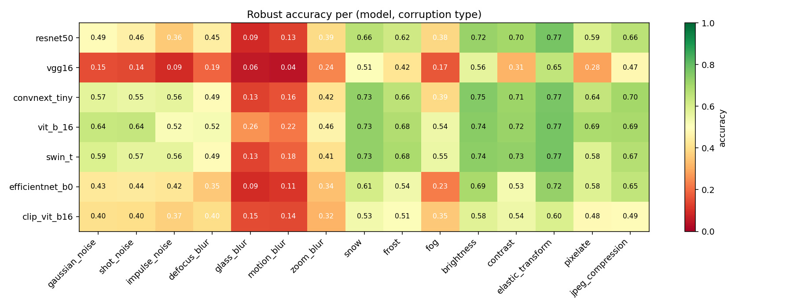
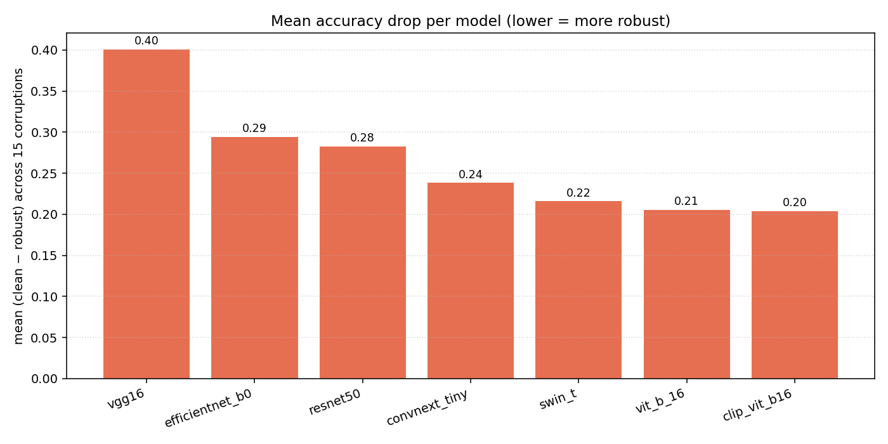
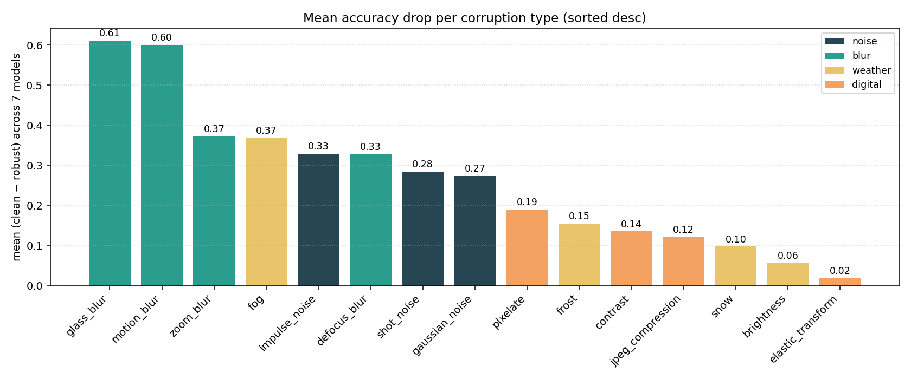
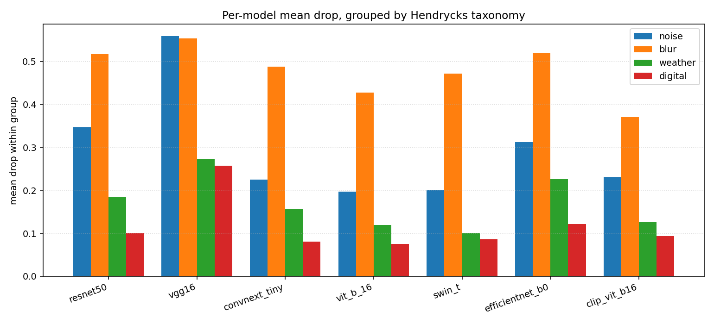

# Common-Corruptions Benchmark — Report

_Run started: 2026-05-26 16:45 UTC.  Author: Sachit Jain._

This report covers Phase 1, Axis A — the 15 ImageNet-C-style common corruptions at severity 3, evaluated on the 7 ImageNet baselines listed in `config.yaml`. The corruption sets are generated once by `scripts/generate_datasets.py --corruptions` and shared across all models; this report aggregates the per-(model, corruption) JSONs in this directory.

## 1. Setup

- **Eval host (where inference ran)**: Tesla T4. torch 2.10.0+cu128, torchvision 0.25.0+cu128.
- **Report rebuilt on**: CPU, Windows-11-10.0.26200-SP0.
- **Attack**: 15 corruption types (`attacks/corruptions.py`), severity 3. Implementation: self-contained NumPy/SciPy/PIL (no `imagenet_c` / ImageMagick dependency). Calibrations follow Hendrycks & Dietterich (ICLR 2019); `motion_blur`/`snow`/`frost`/`fog` use NumPy approximations of the canonical Wand versions and may not be bit-equivalent to the published ImageNet-C numbers.
- **Dataset**: the full 1000-image clean benchmark, pre-cropped to 224×224 (torchvision eval transform) before corruption. One corrupted variant per (clean image, corruption type) = 15000 images total.
- **Global seed**: 42 (`config.yaml`). Per-(image, corruption) RNG seeded with `(seed + sha1(corruption_type) + image_index)` so a single corruption type can be regenerated without touching the others.

## 2. Headline (robust accuracy per (model, corruption))

| model | gaussian_noise | shot_noise | impulse_noise | defocus_blur | glass_blur | motion_blur | zoom_blur | snow | frost | fog | brightness | contrast | elastic_transform | pixelate | jpeg_compression | mean_robust | mean_drop |
| --- | --- | --- | --- | --- | --- | --- | --- | --- | --- | --- | --- | --- | --- | --- | --- | --- | --- |
| resnet50 | 0.487 | 0.457 | 0.358 | 0.447 | 0.088 | 0.129 | 0.393 | 0.664 | 0.618 | 0.384 | 0.721 | 0.700 | 0.771 | 0.594 | 0.660 | 0.498 | 0.283 |
| vgg16 | 0.150 | 0.143 | 0.091 | 0.190 | 0.056 | 0.045 | 0.242 | 0.511 | 0.420 | 0.165 | 0.563 | 0.313 | 0.647 | 0.285 | 0.475 | 0.286 | 0.401 |
| convnext_tiny | 0.567 | 0.554 | 0.565 | 0.489 | 0.130 | 0.160 | 0.417 | 0.730 | 0.656 | 0.387 | 0.750 | 0.712 | 0.769 | 0.643 | 0.701 | 0.549 | 0.238 |
| vit_b_16 | 0.636 | 0.637 | 0.515 | 0.522 | 0.258 | 0.216 | 0.463 | 0.730 | 0.677 | 0.543 | 0.743 | 0.717 | 0.773 | 0.686 | 0.695 | 0.587 | 0.206 |
| swin_t | 0.592 | 0.566 | 0.563 | 0.490 | 0.134 | 0.181 | 0.408 | 0.727 | 0.684 | 0.549 | 0.738 | 0.728 | 0.773 | 0.583 | 0.671 | 0.559 | 0.216 |
| efficientnet_b0 | 0.432 | 0.436 | 0.425 | 0.353 | 0.093 | 0.110 | 0.337 | 0.609 | 0.536 | 0.226 | 0.695 | 0.526 | 0.725 | 0.585 | 0.647 | 0.449 | 0.294 |
| clip_vit_b16 | 0.403 | 0.400 | 0.368 | 0.396 | 0.147 | 0.141 | 0.316 | 0.533 | 0.511 | 0.355 | 0.579 | 0.543 | 0.596 | 0.481 | 0.488 | 0.417 | 0.204 |

Machine-readable copies: `accuracy_matrix.csv` (wide), `accuracy_table.csv` (long).

## 3. Sanity checks

- **Severity-3 mean drop in literature window [0.05, 0.25]**: observed **0.263**  →  **FAIL**.
- **Every corruption causes >1% drop on ≥5 of 7 models**: PASS — all 15 types meet the bar.
- **Coverage**: 105 / 105 (model × corruption) pairs reported.  **PASS**.

## 4. Per-axis analysis

Across 7 of 7 models and 15 of 15 corruption types at severity 3, the mean accuracy drop was **0.263**. The most robust model on this axis was `clip_vit_b16` (mean drop **0.204**); the least robust was `vgg16` (mean drop **0.401**). The hardest corruption type (averaged across models) was `glass_blur` with mean drop **0.612**; the easiest was `elastic_transform` with mean drop **0.019**.

## 5. Figures

  
*Figure 1 — Robust accuracy heatmap (7 models × 15 corruptions).*
  
*Figure 2 — Mean accuracy drop per model (averaged across 15 corruptions).*
  
*Figure 3 — Mean accuracy drop per corruption type (averaged across 7 models).*
  
*Figure 4 — Per-model mean drop grouped by Hendrycks taxonomy.*
  
*Figure 5 — One image under each corruption type.*

## 6. Interpretation

Common corruptions are the non-adversarial, distribution-shift end of the robustness spectrum: each image is degraded by physical noise, blur, weather, or digital artifacts in a way that a human would still classify correctly. The drops here represent **realistic deployment failures** (a webcam in fog, a low-bandwidth JPEG upload, a shaky phone photo), not worst-case adversarial inputs. Unlike the gradient and typographic axes, this measure decouples natural fragility from language grounding — every model is graded on the same model-agnostic transformation. The Phase D defense will be re-evaluated on this axis to check whether adversarial fine-tuning sacrifices natural-corruption robustness as a side effect.

## 7. Reproducibility footer

- **Wall-clock (this report build session)**: 0.0 min.
- **Per-model cumulative compute (sum across 15 corruptions)**: clip_vit_b16 7.0 min, convnext_tiny 3.4 min, efficientnet_b0 1.8 min, resnet50 2.9 min, swin_t 3.9 min, vgg16 3.5 min, vit_b_16 6.8 min.
- **Total compute (sum across model × corruption)**: 29.3 min.
- **Seed**: 42 (set on `random`, `numpy`, `torch`).
- **Re-run**: `python scripts/generate_datasets.py --corruptions --severity 3` then `python scripts/run_corruptions_benchmark.py` then `python scripts/build_corruptions_report.py` then `python scripts/build_gradient_report_pdf.py --input results/corruptions/REPORT.md --output results/corruptions/REPORT.pdf`. Per-(model, corruption) JSONs are the resumption unit — delete one to force its recomputation.
