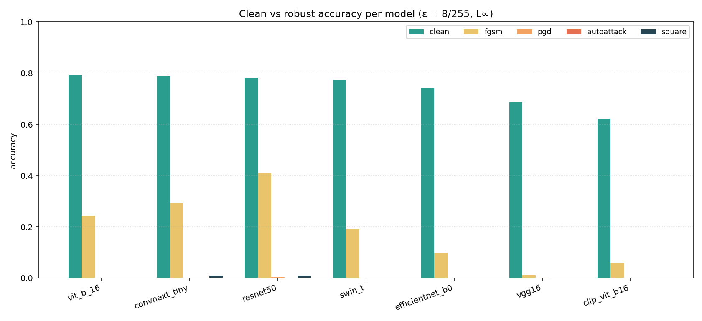
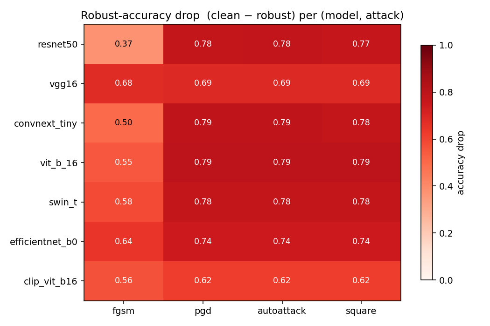
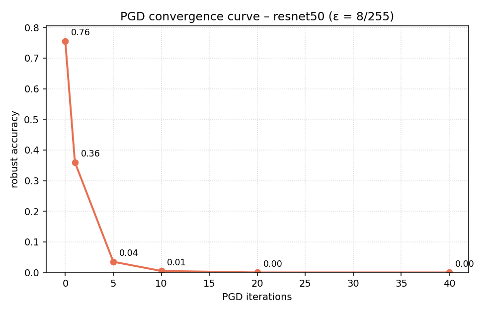
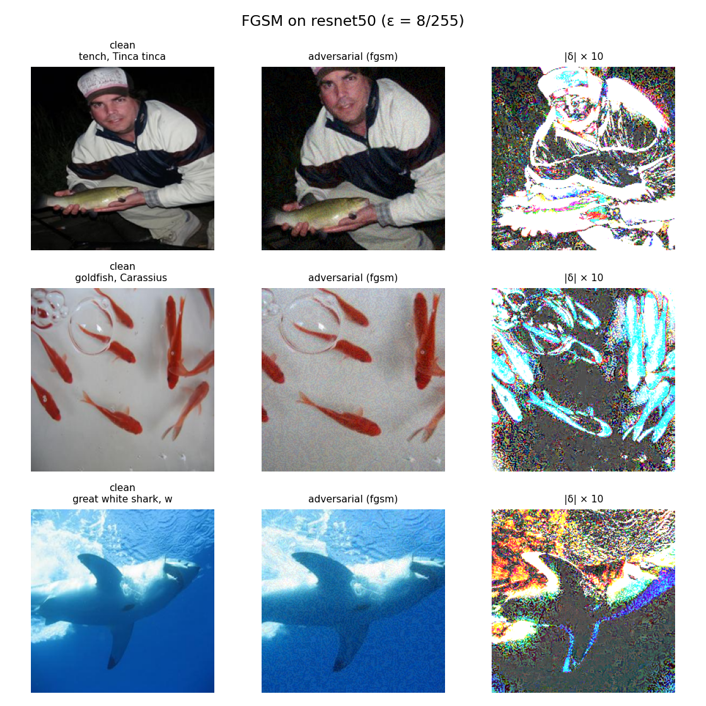
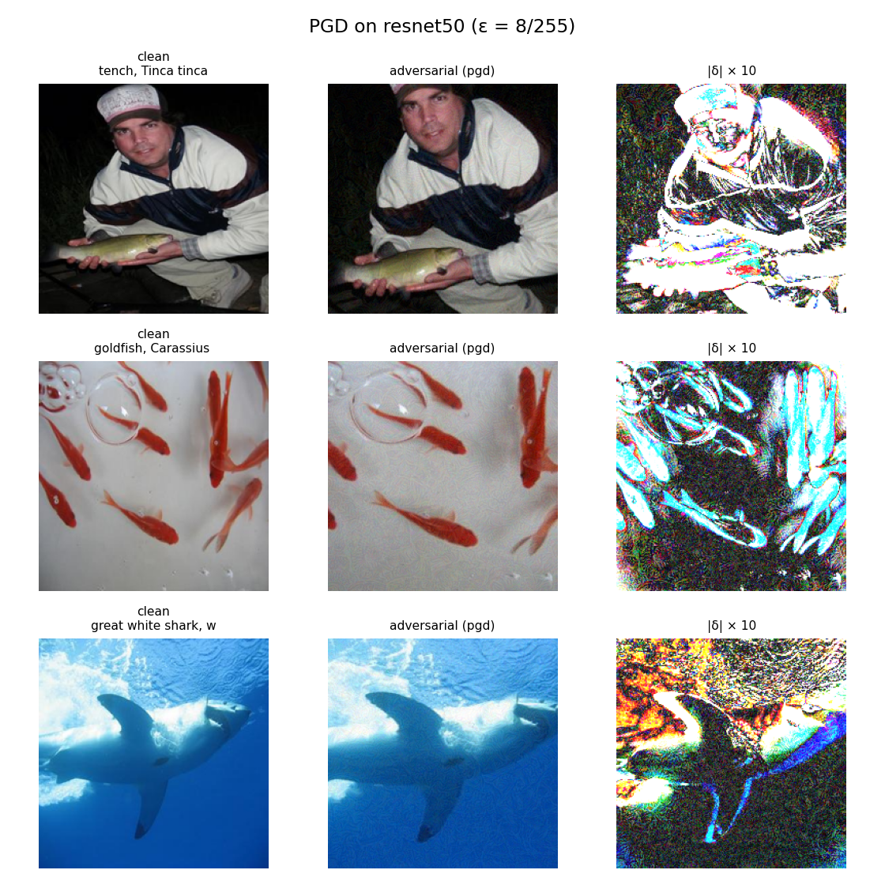
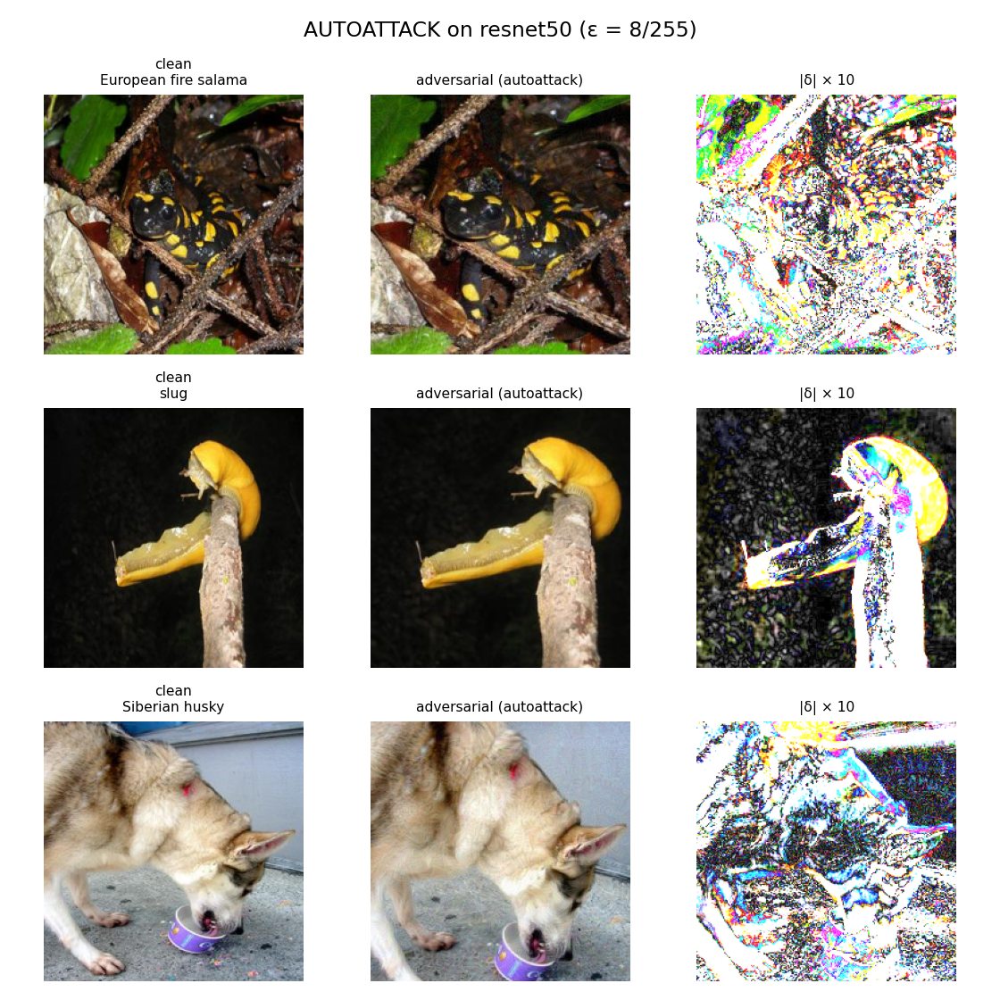
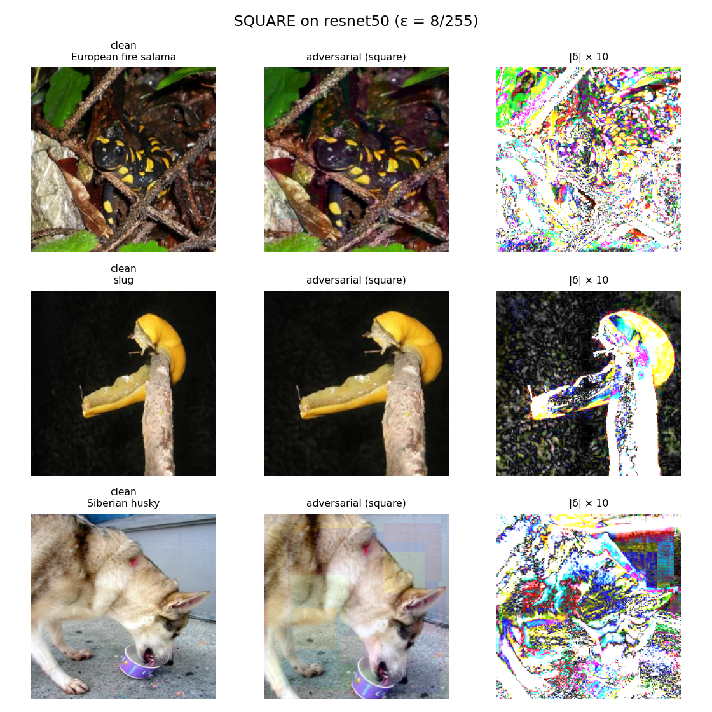

# Gradient-Attack Benchmark — Report

_Run started: 2026-05-22 18:20 UTC.  Author: Sachit Jain._

This report covers Phase 1 of the project — the four gradient-based L∞ attacks (FGSM, PGD, AutoAttack, Square) against the 7 undefended ImageNet baselines listed in `config.yaml`. All hyperparameters come from `config.yaml` and the per-(model, attack) JSONs in this directory; nothing in this report is hand-edited.

## 1. Setup

- **Hardware**: Tesla T4 (single GPU used at a time).
- **OS**: Linux-6.6.122+-x86_64-with-glibc2.35.
- **Libraries**: torch 2.10.0+cu128, torchvision 0.25.0+cu128, transformers 5.0.0, torchattacks 3.5.1, autoattack unknown.
- **Threat model**: L∞, ε = 8/255 ≈ 0.031373 in [0,1] pixel space.
- **PGD**: 20 steps of size 2/255, random start, seed = 42 (`attacks/gradient.py:88`).
- **AutoAttack**: `standard` ensemble — APGD-CE, APGD-T, FAB-T, Square (`attacks/gradient.py:141`). Batch sizes 16–32 depending on model (T4 memory).
- **Square**: 5,000 queries, seed = 42 (`attacks/gradient.py:182`).
- **Datasets**: FGSM/PGD on the full 1000-image clean benchmark (`data/clean/manifest.json`). AutoAttack / Square on the seeded 200-image class-balanced subset built by `datasets.loader.load_eval_subset(200, seed=42)` (`config.yaml` keys `autoattack_eval_subset`, `square_eval_subset`).
- **Global seed**: 42 (config.yaml). Set on `random`, `numpy`, and `torch` at the start of every (model, attack) cell.

## 2. Headline accuracy table

| Model | Clean | FGSM | PGD | AutoAttack | Square |
| --- | --- | --- | --- | --- | --- |
| resnet50 | 0.781 | 0.408 | 0.004 | 0.000 | 0.010 |
| vgg16 | 0.687 | 0.011 | 0.001 | 0.000 | 0.000 |
| convnext_tiny | 0.787 | 0.292 | 0.000 | 0.000 | 0.010 |
| vit_b_16 | 0.793 | 0.244 | 0.000 | 0.000 | 0.000 |
| swin_t | 0.775 | 0.191 | 0.000 | 0.000 | 0.000 |
| efficientnet_b0 | 0.743 | 0.100 | 0.000 | 0.000 | 0.000 |
| clip_vit_b16 | 0.621 | 0.058 | 0.000 | 0.000 | 0.000 |

Machine-readable copy: `accuracy_table.csv`.

Clean accuracy is computed on the full 1000-image set (FGSM/PGD) — the AutoAttack/Square cells re-evaluate clean accuracy on the 200-image subset, with very similar values (per-cell JSONs).

## 3. Sanity checks (project brief, Section 7)

- **PGD measurably reduces VGG-16 accuracy.**  Clean **0.687** → PGD-robust **0.001** (drop **0.686**, threshold > 0.20). **PASS**.
- **AutoAttack robust acc ≤ PGD robust acc for every model.**
  - `resnet50`: AA **0.000** vs PGD **0.004** → **PASS**.
  - `vgg16`: AA **0.000** vs PGD **0.001** → **PASS**.
  - `convnext_tiny`: AA **0.000** vs PGD **0.000** → **PASS**.
  - `vit_b_16`: AA **0.000** vs PGD **0.000** → **PASS**.
  - `swin_t`: AA **0.000** vs PGD **0.000** → **PASS**.
  - `efficientnet_b0`: AA **0.000** vs PGD **0.000** → **PASS**.
  - `clip_vit_b16`: AA **0.000** vs PGD **0.000** → **PASS**.
- **Square robust acc is not dramatically lower than PGD's** (gradient-masking probe; threshold gap > 0.10).
  - `resnet50`: PGD **0.004** vs Square **0.010** (PGD − Square = **-0.006**) → ok.
  - `vgg16`: PGD **0.001** vs Square **0.000** (PGD − Square = **+0.001**) → ok.
  - `convnext_tiny`: PGD **0.000** vs Square **0.010** (PGD − Square = **-0.010**) → ok.
  - `vit_b_16`: PGD **0.000** vs Square **0.000** (PGD − Square = **+0.000**) → ok.
  - `swin_t`: PGD **0.000** vs Square **0.000** (PGD − Square = **+0.000**) → ok.
  - `efficientnet_b0`: PGD **0.000** vs Square **0.000** (PGD − Square = **+0.000**) → ok.
  - `clip_vit_b16`: PGD **0.000** vs Square **0.000** (PGD − Square = **+0.000**) → ok.

## 4. Gradient-masking verdict

Decision rule: a model is flagged for gradient masking when the PGD − Square robust-accuracy gap exceeds **0.10** — i.e. when the black-box attack is substantially more effective than the white-box one, which is the standard signature of obfuscated gradients (Athalye et al., 2018).

- `resnet50`: **no**  (Square − PGD = +0.006; flagged if PGD − Square > 0.10)
- `vgg16`: **no**  (Square − PGD = -0.001; flagged if PGD − Square > 0.10)
- `convnext_tiny`: **no**  (Square − PGD = +0.010; flagged if PGD − Square > 0.10)
- `vit_b_16`: **no**  (Square − PGD = -0.000; flagged if PGD − Square > 0.10)
- `swin_t`: **no**  (Square − PGD = -0.000; flagged if PGD − Square > 0.10)
- `efficientnet_b0`: **no**  (Square − PGD = -0.000; flagged if PGD − Square > 0.10)
- `clip_vit_b16`: **no**  (Square − PGD = -0.000; flagged if PGD − Square > 0.10)

**No models** exhibited gradient masking under this threshold.

## 5. Per-attack analysis

### FGSM

FGSM (`attacks/gradient.py:66`) is the cheapest baseline — a single signed-gradient step of size ε = 8/255 in L∞. It dropped accuracy by an average of **0.55** absolute across the 7 models on the full 1000-image clean set. The drop is sizeable but not catastrophic: because FGSM commits one large step without iterative refinement, it overshoots the local loss landscape for many examples and the attack is partly wasted. It is included here as the standard "weak" baseline; results from FGSM alone are not sufficient to conclude that a model is robust — a stronger iterative attack must follow.

### PGD

PGD (`attacks/gradient.py:88`) takes 20 signed-gradient steps of size 2/255 inside the ε-ball with a uniform random start. It is the standard workhorse white-box attack. Across the 7 undefended models average robust accuracy collapses to **0.00** — and the weakest model (convnext_tiny) drops to **0.00**. The contrast with FGSM is exactly what we expect: iteratively projecting back into the ε-ball recovers most of the loss FGSM leaves on the table, confirming that all seven baselines are catastrophically vulnerable under a properly tuned first-order attack.

### AutoAttack

AutoAttack (`attacks/gradient.py:141`) runs the standard parameter-free ensemble: APGD-CE, APGD-T, FAB-T, and Square. We evaluate it on the seeded 200-image class-balanced subset declared in `config.yaml` (`autoattack_eval_subset: 200`) — the brief calls this out for compute reasons. Average robust accuracy across the 7 models is **0.00**, and crucially AutoAttack ≤ PGD for every model — the sanity check passes. AutoAttack is the gold standard precisely because its targeted variants and adaptive step sizes plug the holes a hand-tuned PGD can miss.

### Square

Square Attack (`attacks/gradient.py:182`) is the black-box score-based reference: 5,000 model-output queries per image, no gradient access. We use it as the gradient-masking probe — if Square (black-box) ever drops accuracy substantially more than PGD (white-box), the white-box result was an artifact of obfuscated gradients, not real robustness. Average Square-robust accuracy across the 7 models is **0.00**, and the per-model comparison is in the sanity-check section.

## 6. Figures

  
*Figure 1 — Clean vs. robust accuracy per model (sorted by clean acc).*
  
*Figure 2 — Robust-accuracy drop (clean − robust) per (model, attack).*
  
*Figure 3 — PGD convergence curve on ResNet-50 (200-image subset).*
  
*Figure 4a — Visual grid for FGSM (clean | adversarial | |δ|×10).*
  
*Figure 4b — Visual grid for PGD (clean | adversarial | |δ|×10).*
  
*Figure 4c — Visual grid for AUTOATTACK (clean | adversarial | |δ|×10).*
  
*Figure 4d — Visual grid for SQUARE (clean | adversarial | |δ|×10).*

## 7. NaN / numerical-stability spot-check

The hand-rolled PGD silently no-ops on NaN gradients (`nan.sign() == 0`, `attacks/gradient.py:131`). A NaN adversarial output would therefore look "robust" when it is really just broken. This run:

- No NaN adversarial outputs detected. The `grad.sign() == 0 on NaN` failure mode (`attacks/gradient.py:131`) was not triggered on this run.

## 8. CLIP caveat

`clip_vit_b16` is used as a zero-shot classifier (`models/classifiers.py:96`). Its logits are scaled by `exp(logit_scale) ≈ 100`, which saturates the softmax. Cross-entropy gradients still flow through `image_features @ text_features.T`, so the white-box attacks operate normally — but be aware that very saturated softmax outputs can make CLIP look more robust than it really is. Compare the AutoAttack vs PGD numbers for `clip_vit_b16` in the sanity-check section above to confirm the white-box attacks are not artificially bottlenecked here.

## 9. Reproducibility footer

- **Wall-clock time (this report build session)**: 0.1 min.
- **Per-attack cumulative compute (sum of per-cell `wall_clock_s`)**: FGSM 3.9 min, PGD 44.7 min, AutoAttack 32.0 min, Square 55.0 min.
- **Total compute (sum across all cells)**: 135.5 min.
- **Library versions**: torch 2.10.0+cu128, torchvision 0.25.0+cu128, transformers 5.0.0, torchattacks 3.5.1, autoattack unknown.
- **GPU**: Tesla T4.
- **Seed**: 42 (set on `random`, `numpy`, `torch`).
- **Re-run**: `python scripts/run_gradient_benchmark.py` then `python scripts/build_gradient_report.py`. Per-(model, attack) JSONs act as the resumption unit — delete one to force its recomputation.
