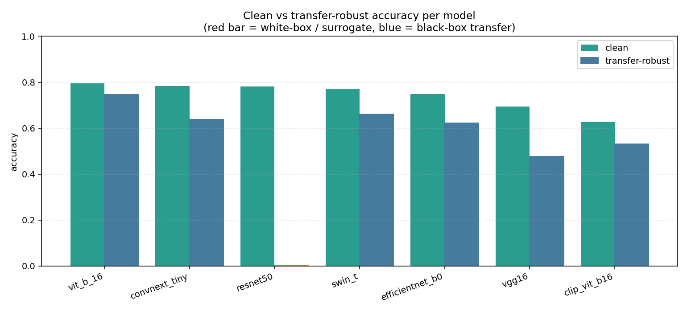
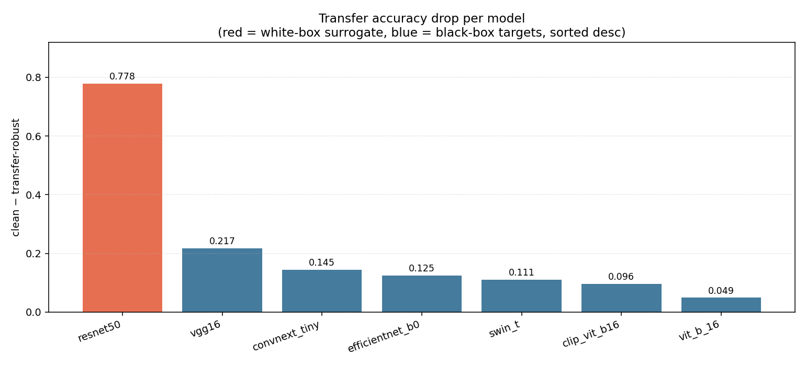

# Transfer-Attack Benchmark — Report

_Run started: 2026-05-28 10:50 UTC.  Author: Sachit Jain._

This report covers Phase B of the project — surrogate-based transfer attack evaluation. PGD adversarial images were crafted once on the `resnet50` surrogate (ε=0.0314, 20 steps) and evaluated on all 7 baseline architectures. The surrogate row is the white-box reference; the other six rows measure cross-architecture transferability.

## 1. Setup

- **Eval host**: Tesla T4. torch 2.10.0+cu128, torchvision 0.25.0+cu128.
- **Report rebuilt on**: Tesla T4, Linux-6.6.122+-x86_64-with-glibc2.35.
- **Attack**: PGD on `resnet50` surrogate. ε=0.031373 (8/255), step=0.007843, 20 steps, random start, seed 42.
- **Dataset**: 1000-image clean benchmark, preprocessed through the `resnet50` model's resize/crop pipeline. All 7 models evaluate on the same pixel tensor via their own normalization inside `logits()`.
- **Global seed**: 42. Set on `random`, `numpy`, `torch`.

## 2. Headline accuracy table

| Model | White-box? | Clean | Transfer-robust | Drop | Fooling rate |
| --- | --- | --- | --- | --- | --- |
| resnet50 | **yes** | 0.781 | 0.003 | 0.778 | 0.996 |
| vgg16 | no | 0.695 | 0.478 | 0.217 | 0.327 |
| convnext_tiny | no | 0.783 | 0.638 | 0.145 | 0.198 |
| vit_b_16 | no | 0.796 | 0.747 | 0.049 | 0.079 |
| swin_t | no | 0.772 | 0.661 | 0.111 | 0.161 |
| efficientnet_b0 | no | 0.748 | 0.623 | 0.125 | 0.186 |
| clip_vit_b16 | no | 0.628 | 0.532 | 0.096 | 0.205 |

Columns: clean accuracy (on surrogate-preprocessed images), transfer-robust accuracy (same adversarial images for all targets), drop (clean − robust), fooling rate (originally-correct images that flipped). **White-box = yes** marks the surrogate itself (ResNet-50).

Machine-readable copy: `accuracy_table.csv`.

## 3. Sanity checks (Gate B)

- **Gate B — self-transfer vs gradient PGD (resnet50):** transfer = **0.003**, gradient PGD = **0.004**, diff = **0.0010** → **PASS** (tolerance ±0.005).
- **Gate B — transferability coverage:** 4/6 non-surrogate models show >10% accuracy drop → **PASS** (need ≥4). Models: ['vgg16', 'convnext_tiny', 'swin_t', 'efficientnet_b0'].
- **Coverage**: 7 / 7 models reported. **PASS**.

## 4. Transferability analysis

PGD-20 adversarial images crafted on `resnet50` (the white-box surrogate) were evaluated against all 7 architectures.  On the surrogate itself (**white-box**), robust accuracy is **0.003** — this should match the gradient phase's PGD result.  Across the 6 black-box target models, the mean accuracy drop is **0.124**. The most susceptible target is `vgg16` (drop **0.217**); the most resistant is `vit_b_16` (drop **0.049**).  Architecture family matters for transferability: CNN → CNN transfers better than CNN → Transformer in general, so ViT/Swin/ConvNeXt are expected to show smaller drops than ResNet/VGG/EfficientNet. Check the table for this pattern.

## 5. Figures

  
*Figure 1 — Clean vs transfer-robust accuracy per model (red = surrogate/white-box).*
  
*Figure 2 — Accuracy drop per model under transfer attack (sorted desc).*

## 6. Reproducibility footer

- **Wall-clock (this report build)**: 0.0 min.
- **Per-model eval time**: clip_vit_b16 0.5 min, convnext_tiny 0.2 min, efficientnet_b0 0.0 min, resnet50 0.1 min, swin_t 0.2 min, vgg16 0.2 min, vit_b_16 0.5 min.
- **Total eval compute**: 1.7 min.
- **Seed**: 42.
- **Re-run**: `python scripts/generate_datasets.py --transfer` then `python scripts/run_transfer_benchmark.py` then `python scripts/build_transfer_report.py` then `python scripts/build_gradient_report_pdf.py --input results/transfer/REPORT.md --output results/transfer/REPORT.pdf`.
