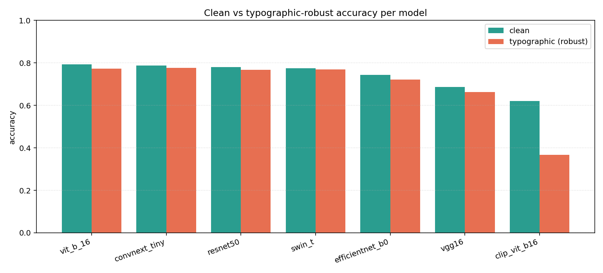
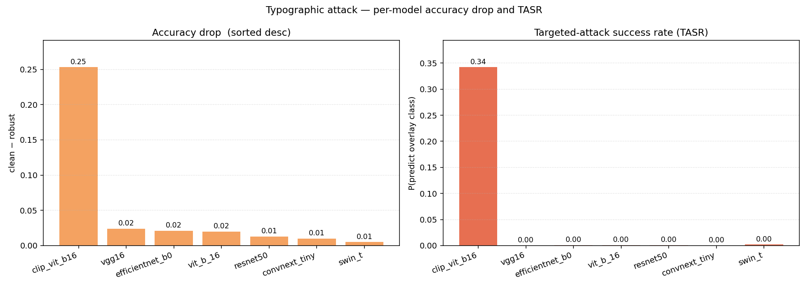
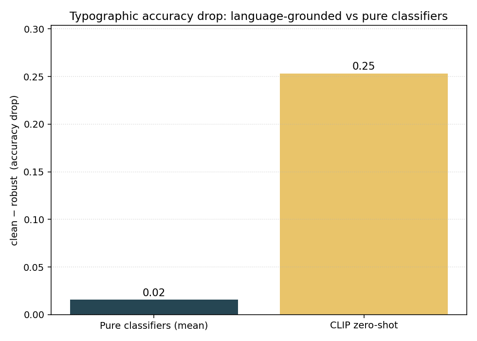
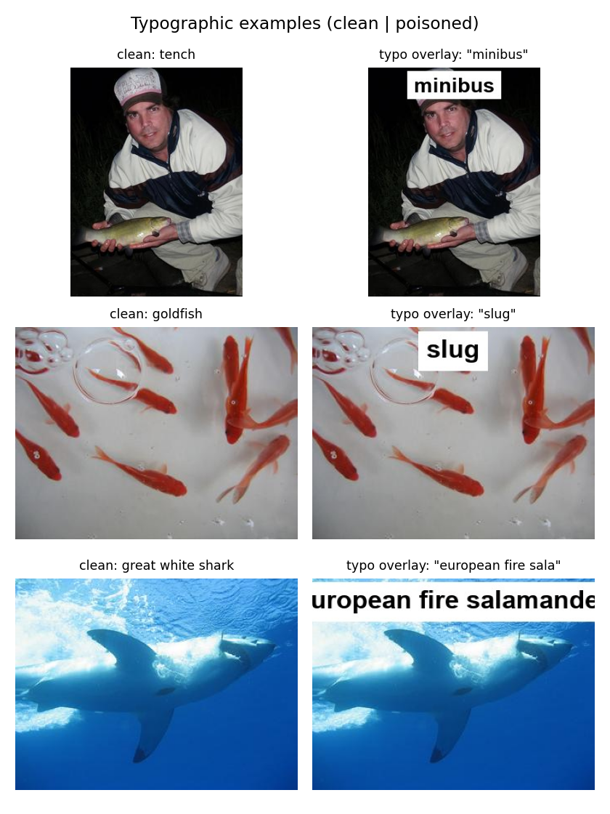

# Typographic-Attack Benchmark — Report

_Run started: 2026-05-25 12:58 UTC.  Author: Sachit Jain._

This report covers Phase 1, Axis C of the project — a single semantic, model-agnostic attack (the typographic overlay) evaluated against the 7 ImageNet baselines listed in `config.yaml`. The poisoned dataset is generated once by `scripts/generate_datasets.py --typographic` and shared across all models; this report aggregates the per-model JSONs in this directory.

## 1. Setup

- **Eval host (where inference ran)**: not recorded in the per-model JSONs for this run (the runner was updated to capture this after these JSONs were written). The actual run was on Kaggle's GPU — see the original per-model `wall_clock_s` numbers below.
- **Report rebuilt on**: CPU, Windows-11-10.0.26200-SP0.
- **Attack**: typographic overlay (`attacks/typographic.py`), white sticker with bold black text drawn near the top of each clean image. Config: `font_size_frac=0.12`, `position='top'`, `padding_frac=0.04`, `opacity=1.0`, `jpeg_quality=90`, `text_form='lowercase_first_synonym'`.
- **Dataset**: the full 1000-image clean benchmark, one poisoned variant per clean image (`data/poisoned/typographic/`). Each poisoned image is stamped with the lowercase first synonym of a random *wrong* ImageNet class, picked deterministically with the global seed.
- **Global seed**: 42 (`config.yaml`). Set on `random`, `numpy`, `torch` at the start of every model.

## 2. Headline accuracy table

| Model | Clean | Robust | Drop | Fooling rate | TASR |
| --- | --- | --- | --- | --- | --- |
| resnet50 | 0.781 | 0.768 | 0.013 | 0.036 | 0.001 |
| vgg16 | 0.687 | 0.663 | 0.024 | 0.076 | 0.000 |
| convnext_tiny | 0.787 | 0.777 | 0.010 | 0.032 | 0.000 |
| vit_b_16 | 0.793 | 0.773 | 0.020 | 0.039 | 0.001 |
| swin_t | 0.775 | 0.770 | 0.005 | 0.032 | 0.002 |
| efficientnet_b0 | 0.743 | 0.722 | 0.021 | 0.055 | 0.001 |
| clip_vit_b16 | 0.621 | 0.368 | 0.253 | 0.452 | 0.342 |

Columns: clean accuracy, robust accuracy (untargeted — did the model flip away from the true label?), accuracy drop (clean − robust), fooling rate (originally-correct images that flipped), and TASR — the **targeted-attack success rate**, the fraction of images where the model predicted the *exact* class named by the overlay text.

Machine-readable copy: `accuracy_table.csv`.

## 3. Sanity checks

- **Typographic overlay causes a non-zero accuracy drop on every model.**
  - `resnet50`: clean **0.781** → robust **0.768** (drop **0.013**) → **PASS**.
  - `vgg16`: clean **0.687** → robust **0.663** (drop **0.024**) → **PASS**.
  - `convnext_tiny`: clean **0.787** → robust **0.777** (drop **0.010**) → **PASS**.
  - `vit_b_16`: clean **0.793** → robust **0.773** (drop **0.020**) → **PASS**.
  - `swin_t`: clean **0.775** → robust **0.770** (drop **0.005**) → **PASS**.
  - `efficientnet_b0`: clean **0.743** → robust **0.722** (drop **0.021**) → **PASS**.
  - `clip_vit_b16`: clean **0.621** → robust **0.368** (drop **0.253**) → **PASS**.
- **Language-grounding effect (finding, not a pass/fail test).**  Pure-classifier mean drop **0.016** vs CLIP drop **0.253**  →  CLIP **more** affected (gap = +0.237). This **inverts** the brief's §3.6 hypothesis (CLIP was expected to resist); see §6 for the implication.
- **Coverage**: 7 / 7 models reported. **PASS**.

## 4. Per-model analysis

Across the 7 evaluated models the typographic overlay caused an average accuracy drop of **0.049** absolute. The most affected model was `clip_vit_b16`, dropping from **0.621** clean to **0.368** robust (drop **0.253**, TASR **0.342**). The six pure-vision classifiers move very little — mean drop **0.016** (max **0.024**, mean TASR **0.001**). At this magnitude the loss is consistent with the sticker simply occluding part of the image; the pure classifiers do not appear to read the rendered text, so they essentially never predict the *exact* overlay class. `clip_vit_b16` (zero-shot, language-grounded) sits at a different operating point: clean **0.621** → robust **0.368** (drop **0.253**, TASR **0.342**). CLIP's drop is **16.3× the pure-classifier mean**, and its TASR shows that in 34% of poisoned images CLIP predicts the *exact* class named on the sticker — a signature of language grounding making the rendered text a first-class semantic feature. This **inverts** the brief's §3.6 hypothesis ("CLIP resists typographic attacks"): on ImageNet classification, language grounding is a *liability* under typographic attacks, not a defense. The pure classifiers' apparent robustness is text-blindness, not robustness in any useful sense — the paper hook becomes the inversion itself.

## 5. Figures

  
*Figure 1 — Clean vs typographic-robust accuracy per model (sorted by clean acc).*
  
*Figure 2 — Accuracy drop and targeted-attack success rate per model.*
  
*Figure 3 — Language-grounded (CLIP) vs pure-classifier mean drop.*
  
*Figure 4 — Clean | poisoned examples (typographic overlay).*

## 6. Interpretation

The typographic attack is the paper's headline semantic attack. The data **inverts the brief's §3.6 hypothesis**: language grounding does *not* make CLIP more robust to typographic overlays — it makes CLIP specifically more vulnerable. CLIP's accuracy drops **0.253** (clean → robust), while the six pure vision classifiers drop only **0.016** on average. CLIP's TASR of **0.342** means that on roughly a third of poisoned images CLIP predicts the *exact* ImageNet class named on the sticker — a clean signature of the rendered text being treated as semantic content. The pure classifiers' near-flat drop is not robustness in any useful sense; it is **text-blindness** (the sticker is just an occluder to them). This finding is consistent with Goh et al. (OpenAI, 2021), who first demonstrated typographic attacks on CLIP under synthetic stimuli; we extend the result to natural ImageNet classification with a controlled, model-shared poisoned dataset. The paper hook becomes the inversion itself, and the Phase 4 defense module now has a falsifiable target: reduce CLIP's typographic TASR substantially without destroying its clean accuracy.

## 7. Reproducibility footer

- **Wall-clock (this report build session)**: 0.0 min.
- **Per-model cumulative compute (sum of per-cell `wall_clock_s`)**: clip_vit_b16 0.5 min, convnext_tiny 0.3 min, efficientnet_b0 0.1 min, resnet50 0.2 min, swin_t 0.3 min, vgg16 0.2 min, vit_b_16 0.4 min.
- **Total compute (sum across models)**: 1.9 min.
- **Eval-host library versions**: not recorded for this run; see future runs once `run_typographic_benchmark.py` populates `host_env`.
- **Eval GPU**: (not recorded — see eval-host note).
- **Report rebuilt on**: CPU, Windows-11-10.0.26200-SP0.
- **Seed**: 42 (set on `random`, `numpy`, `torch`).
- **Re-run**: `python scripts/run_typographic_benchmark.py` then `python scripts/build_typographic_report.py` then `python scripts/build_gradient_report_pdf.py --input results/typographic/REPORT.md --output results/typographic/REPORT.pdf`. Per-model JSONs are the resumption unit — delete one to force its recomputation.
